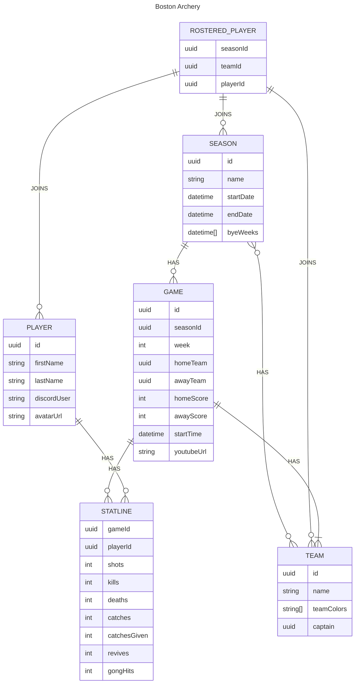

# Database

## Intro

This project uses AWS's DynamoDB as its database, utilizing single table design.

DynamoDB was chosen primarily to keep prices down, as it offers pay per request billing rather than paying to keep a database running 24/7.

## ERD

## Access patterns

| Access Pattern                                        | Table/GSI/LSI | Key Condition               | Filter Expression |
| ----------------------------------------------------- | ------------- | --------------------------- | ----------------- |
| Create/Update Season by ID                            | Table         | PK=SeasonID and SK=SeasonID |                   |
| Get season by ID                                      | Table         | PK=SeasonID and SK=SeasonID |                   |
| Get list of all seasons                               | GSI1          | PK="SEASON"                 |                   |
| Get dog eat dog winner/stats by season                | TODO          | TODO                        |                   |
| Get stat totals by season?                            | TODO          | TODO                        |                   |
| Get players by season                                 | TODO          | TODO                        |                   |
| Get all team records and points by season (standings) | TODO          | TODO                        |                   |
| Get all stat records by season                        | TODO          | TODO                        |                   |
| Create/Update Team by ID                              | Table         | PK=TeamID and SK=TeamID     |                   |
| Get team by ID                                        | Table         | PK=TeamID and SK=TeamID     |                   |
| Get all teams                                         | GSI1          | PK="TEAM"                   |                   |
| Get all teams by season                               | TODO          | TODO                        |                   |
| Get all team stats by season                          | TODO          | TODO                        |                   |
| Get team stats all time                               | TODO          | TODO                        |                   |
| Get team roster by season                             | TODO          | TODO                        |                   |
| Get record by team all time                           | TODO          | TODO                        |                   |
| Get points by team all time                           | TODO          | TODO                        |                   |
| Create/Update Player by ID                            | Table         | PK=PlayerID and SK=PlayerID |                   |
| Get player by ID                                      | Table         | PK=PlayerID and SK=PlayerID |                   |
| Get all players                                       | GSI1          | PK="PLAYER"                 |                   |
| Get player stats by season                            | TODO          | TODO                        |                   |
| Get player stats by year                              | TODO          | TODO                        |                   |
| Get dog eat dog stats by player                       | TODO          | TODO                        |                   |
| Get record by player all time                         | TODO          | TODO                        |                   |
| Get record by player by season                        | TODO          | TODO                        |                   |
| Get stat improvements by season                       | TODO          | TODO                        |                   |
| Create/Update Game by ID                              | TODO          | TODO                        |                   |
| Get game by ID                                        | TODO          | TODO                        |                   |
| Get all games by player                               | TODO          | TODO                        |                   |
| Get all games by season                               | TODO          | TODO                        |                   |
| Get next week games                                   | TODO          | TODO                        |                   |
| Get last week games                                   | TODO          | TODO                        |                   |
| Get all games by team                                 | TODO          | TODO                        |                   |
| Get all player stats by game                          | TODO          | TODO                        |                   |
| Get team stats by game                                | TODO          | TODO                        |                   |
| Add dog eat dog winners by game                       | TODO          | TODO                        |                   |
| Set rosters/lineup/subs per game                      | TODO          | TODO                        |                   |
| Get individual stat records by year                   | TODO          | TODO                        |                   |
| Get individual stat records all time                  | TODO          | TODO                        |                   |
