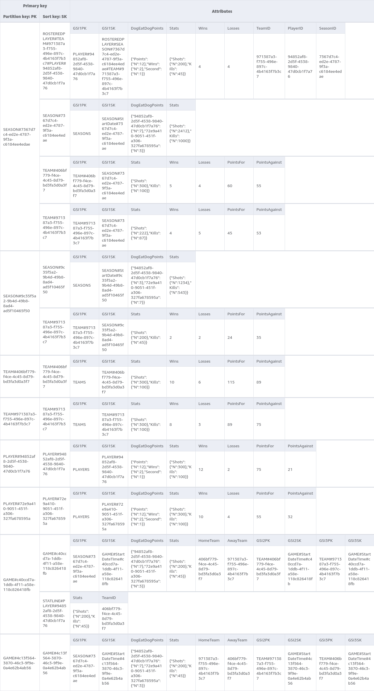

# Database

## Intro

This project uses AWS's DynamoDB as its database, utilizing single table design.

DynamoDB was chosen primarily to keep prices down, as it offers pay per request billing rather than paying to keep a database running 24/7.

## ERD

## Dynamo entity primary keys

See [the example nosqlworkbench file](./nosqlworkbench.json) for an example table to mess around with. You can import the JSON into [NoSQL workbench](https://docs.aws.amazon.com/amazondynamodb/latest/developerguide/workbench.html)'s data visualizer.

### Table

| Entity           | PK                   | SK                                                 |
| ---------------- | -------------------- | -------------------------------------------------- |
| Season           | `SEASON${SeasonID}`  | `SEASON#${SeasonID}`                               |
| Team             | `TEAM#${TeamID}`     | `TEAM#${TeamID}`                                   |
| Season-Team join | `SEASON#${SeasonID}` | `TEAM#${TeamID}`                                   |
| Player           | `PLAYER#${PlayerID}` | `PLAYER#${PlayerID}`                               |
| Rostered Player  | `SEASON#${SeasonID}` | `ROSTEREDPLAYER#TEAM#${TeamID}#PLAYER#${PlayerID}` |
| Game             | `GAME#${GameID}`     | `GAME#${GameID}`                                   |
| Stat Line        | `GAME#${GameID}`     | `STATLINE#PLAYER#${PlayerId}`                      |

### GSI1

| Entity           | PK                   | SK                                                 |
| ---------------- | -------------------- | -------------------------------------------------- |
| Season           | `SEASONS`            | `SEASON#${StartDate}#${SeasonID}`                  |
| Team             | `TEAMS`              | `TEAM#${TeamID}`                                   |
| Season-Team join | `TEAM#${TeamID}`     | `SEASON#${SeasonID}`                               |
| Player           | `PLAYERS`            | `PLAYER#${PlayerID}`                               |
| Rostered Player  | `PLAYER#${PlayerID}` | `ROSTEREDPLAYER#SEASON#${SeasonID}#TEAM#${TeamID}` |
| Game             | `SEASON#${GameID}`   | `GAME#${StartDateTime}#${GameID}`                  |
| Stat Line        | N/A                  | N/A                                                |

### GSI2

| Entity           | PK                   | SK                                |
| ---------------- | -------------------- | --------------------------------- |
| Season           | N/A                  | N/A                               |
| Team             | N/A                  | N/A                               |
| Season-Team join | N/A                  | N/A                               |
| Player           | N/A                  | N/A                               |
| Rostered Player  | N/A                  | N/A                               |
| Game             | `TEAM#${HomeTeamID}` | `GAME#${StartDateTime}#${GameID}` |
| Stat Line        | N/A                  | N/A                               |

### GSI3

| Entity           | PK                   | SK                                |
| ---------------- | -------------------- | --------------------------------- |
| Season           | N/A                  | N/A                               |
| Team             | N/A                  | N/A                               |
| Season-Team join | N/A                  | N/A                               |
| Player           | N/A                  | N/A                               |
| Rostered Player  | N/A                  | N/A                               |
| Game             | `TEAM#${AwayTeamID}` | `GAME#${StartDateTime}#${GameID}` |
| Stat Line        | N/A                  | N/A                               |

## Access patterns

| Access Pattern                                        | Table/GSI/LSI | Key Condition                                                                      | Filter Expression | Notes                                                    |
| ----------------------------------------------------- | ------------- | ---------------------------------------------------------------------------------- | ----------------- | -------------------------------------------------------- |
| Create/Update Season by ID                            | Table         | PK=`"SEASON#${SeasonID}"` and SK=`"SEASON#${SeasonID}"`                            |                   |                                                          |
| Get season by ID                                      | Table         | PK=`"SEASON#${SeasonID}"` and SK=`"SEASON#${SeasonID}"`                            |                   |                                                          |
| Get list of all seasons ordered by date               | GSI1          | PK="SEASONS"                                                                       |                   | Can reverse sort order in query if needed                |
| Get dog eat dog winner/stats by season                | Table         | PK=`"SEASON#${SeasonID}"` and SK=`"SEASON#${SeasonID}"`                            |                   |                                                          |
| Get stat totals by season?                            | Table         | PK=`"SEASON#${SeasonID}"` and SK=`"SEASON#${SeasonID}"`                            |                   |                                                          |
| Get all teams by season                               | Table         | PK=`"SEASON#${SeasonID}"` and SK `startsWith("TEAM#")`                             |                   |                                                          |
| Get all team records and points by season (standings) | Table         | PK=`"SEASON#${SeasonID}"` and SK `startsWith("TEAM#")`                             |                   |                                                          |
| Get all stat records by season                        | TODO          | TODO                                                                               |                   |                                                          |
| Create/Update Team by ID                              | Table         | PK=`"TEAM#${TeamID}"` and SK=`"TEAM#${TeamID}"`                                    |                   |                                                          |
| Get team by ID                                        | Table         | PK=`"TEAM#${TeamID}"` and SK=`"TEAM#${TeamID}"`                                    |                   |                                                          |
| Get all teams                                         | GSI1          | PK="TEAMS"                                                                         |                   |                                                          |
| Get all seasons by team                               | GSI1          | PK=`"TEAM#${TeamID}"` and SK `startsWith("SEASON#")`                               |                   |                                                          |
| Get all team stats by season                          | Table         | PK=`"SEASON#${SeasonID}"` and SK=`"TEAM#${TeamID}"`                                |                   |                                                          |
| Get team stats all time                               | Table         | PK=`"TEAM#${TeamID}"` and SK=`"TEAM#${TeamID}"`                                    |                   |                                                          |
| Get team roster by season                             | Table         | PK=`"SEASON#${SeasonID}"` and SK `startsWith("ROSTEREDPLAYER#TEAM#${TeamID}")`     |                   |                                                          |
| Get record by team all time                           | Table         | PK=`"TEAM#${TeamID}"` and SK=`"TEAM#${TeamID}"`                                    |                   |                                                          |
| Get points by team all time                           | Table         | PK=`"TEAM#${TeamID}"` and SK=`"TEAM#${TeamID}"`                                    |                   |                                                          |
| Create/Update Player by ID                            | Table         | PK=`"PLAYER#${PlayerID}"` and SK=`"PLAYER#${PlayerID}"`                            |                   |                                                          |
| Get player by ID                                      | Table         | PK=`"PLAYER#${PlayerID}"` and SK=`"PLAYER#${PlayerID}"`                            |                   |                                                          |
| Get all players                                       | GSI1          | PK="PLAYERS"                                                                       |                   |                                                          |
| Get players by season                                 | Table         | PK=`"SEASON#${SeasonID}"` and SK `startsWith("ROSTEREDPLAYER#")`                   |                   |                                                          |
| Get player stats by season                            | GSI1          | PK=`"PLAYER#${PlayerID}"` and SK `startsWith("ROSTEREDPLAYER#SEASON#${SeasonID}")` |                   |                                                          |
| Get all player stats by season                        | Table         | PK=`"SEASON#${SeasonID}"` and SK `startsWith("ROSTEREDPLAYER#")`                   |                   |                                                          |
| Get player stats by year                              | TODO          | TODO                                                                               |                   |                                                          |
| Get all player stats by year                          | TODO          | TODO                                                                               |                   |                                                          |
| Get player stats all time                             | Table         | PK=`"PLAYER#${PlayerID}"` and SK=`"PLAYER#${PlayerID}"`                            |                   |                                                          |
| Get dog eat dog stats by player                       | Table         | PK=`"PLAYER#${PlayerID}"` and SK=`"PLAYER#${PlayerID}"`                            |                   |                                                          |
| Get dog eat dog stats by player by season             | GSI1          | PK=`"PLAYER#${PlayerID}"` and SK `startsWith("ROSTEREDPLAYER#SEASON#${SeasonID}")` |                   |                                                          |
| Get record and points by player all time              | Table         | PK=`"PLAYER#${PlayerID}"` and SK=`"PLAYER#${PlayerID}"`                            |                   |                                                          |
| Get record by player by season                        | GSI1          | PK=`"PLAYER#${PlayerID}"` and SK `startsWith("ROSTEREDPLAYER#SEASON#${SeasonID}")` |                   |                                                          |
| Get player stat improvements by season                | TODO          | TODO                                                                               |                   |                                                          |
| Create/Update Game by ID                              | Table         | PK=`"GAME#${GameID}"` and SK=`"GAME#${GameID}"`                                    |                   |                                                          |
| Get game by ID                                        | Table         | PK=`"GAME#${GameID}"` and SK=`"GAME#${GameID}"`                                    |                   |                                                          |
| Get all games by player                               | TODO          | TODO                                                                               |                   |                                                          |
| Get all games by season                               | GSI1          | PK=`"SEASON#${SeasonID}"` and SK `startsWith("GAME#")`                             |                   |                                                          |
| Get next week games by season                         | GSI1          | PK=`"SEASON#${SeasonID}"` and SK `startsWith("GAME#")`                             |                   | Reverse sort, get most recent 3                          |
| Get last week games by season                         | GSI1          | PK=`"SEASON#${SeasonID}"` and SK `startsWith("GAME#")`                             |                   | Reverse sort, get most recent 6, take last 3             |
| Get all games by team                                 | GSI2 and GSI3 | PK=`"TEAM#${TeamID}"` and SK `startsWith("GAME#")`                                 |                   | Will be ordered games furtherest in the past first       |
| Get all player stats by game                          | Table         | PK=`"GAME#${GameID}"` and SK `startsWith("STATLINE#PLAYER#")`                      |                   |                                                          |
| Get team stats by game                                | N/A           | N/A                                                                                |                   | Fetch all player stats for the game, sum them up by team |
| Add dog eat dog winners by game                       | Table         | PK=`"SEASON#${SeasonID}"` and SK=`"GAME#${GameID}"`                                |                   |                                                          |
| Set rosters/lineup/subs per game                      | TODO          | TODO                                                                               |                   |                                                          |
| Get individual stat records by year                   | TODO          | TODO                                                                               |                   |                                                          |
| Get individual stat records all time                  | TODO          | TODO                                                                               |                   |                                                          |
