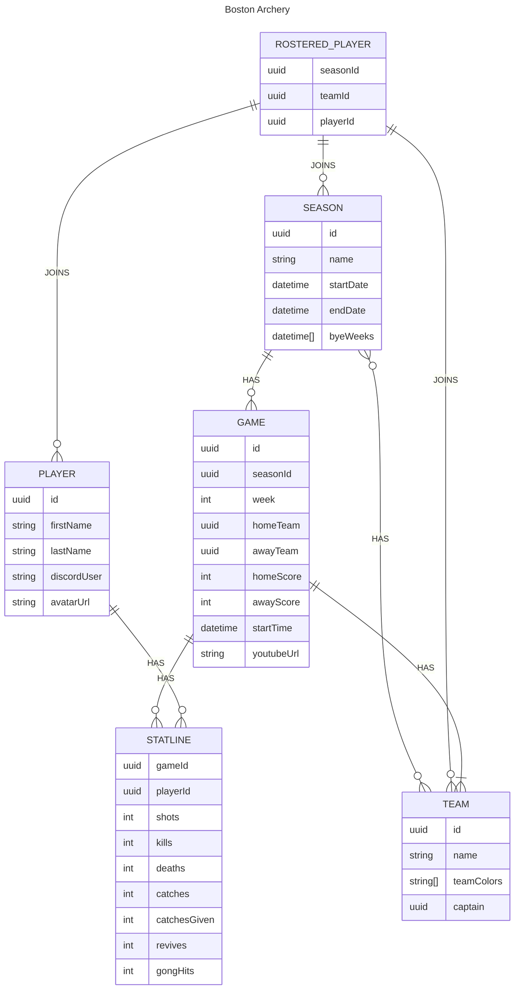

# erd

```mermaid
---
title: Boston Archery
---
erDiagram
SEASON {
    uuid id
    string name
    datetime startDate
    datetime endDate
    datetime[] byeWeeks
}
TEAM {
    uuid id
    string name
    string[] teamColors
    uuid captain
}
SEASON }o--o{ TEAM : HAS
PLAYER {
    uuid id
    string firstName
    string lastName
    string discordUser
    string avatarUrl
}
ROSTERED_PLAYER {
    uuid seasonId
    uuid teamId
    uuid playerId
}
ROSTERED_PLAYER ||--o{ PLAYER : JOINS
ROSTERED_PLAYER ||--o{ TEAM : JOINS
ROSTERED_PLAYER ||--o{ SEASON : JOINS
GAME {
    uuid id
    uuid seasonId
    int week
    uuid homeTeam
    uuid awayTeam
    int homeScore
    int awayScore
    datetime startTime
    string youtubeUrl
}
SEASON ||--o{ GAME : HAS
GAME ||--|{ TEAM : HAS
STATLINE {
    uuid gameId
    uuid playerId
    int shots
    int kills
    int deaths
    int catches
    int catchesGiven
    int revives
    int gongHits
}
GAME ||--o{ STATLINE : HAS
PLAYER ||--o{ STATLINE : HAS
```
